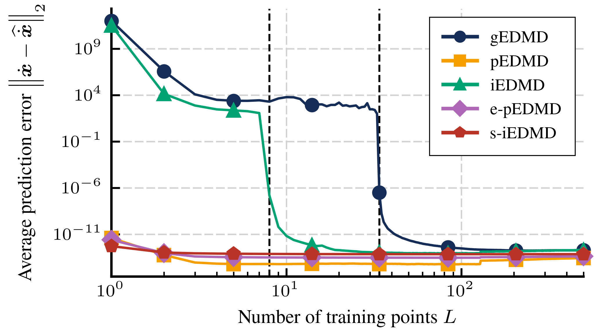
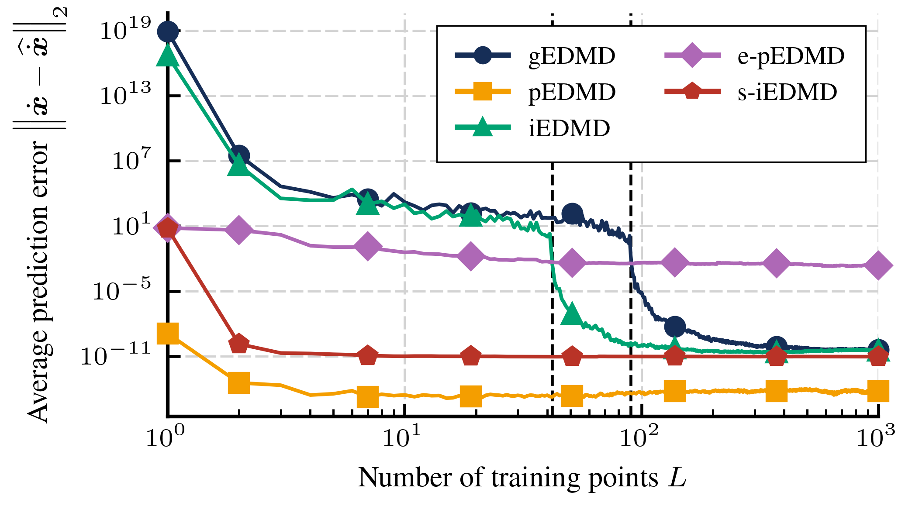

# PIKE — Parameter-Independent Koopman Expansion

[](paper.pdf)
[](https://www.python.org/)
[](https://pytorch.org/)
[](LICENSE)

<iframe width="560" height="315" src="https://www.youtube.com/embed/bVJ7gLQP4Vc?si=8Yjpl6p0NEu3iNyn" title="YouTube video player" frameborder="0" allow="accelerometer; autoplay; clipboard-write; encrypted-media; gyroscope; picture-in-picture; web-share" referrerpolicy="strict-origin-when-cross-origin" allowfullscreen></iframe>

This repository contains the implementation of the **PIKE** (Parameter-Independent Koopman Expansion) algorithm for polynomial systems, as well as the family of estimation algorithms introduced in the companion paper:

> **Transfer Learning via Parameter-Independent Koopman Expansion**  
> Thomas Mongaillard, Vineeth S. Varma, Samson Lasaulce  
> *Under review — IEEE Transactions on Automatic Control*

## What this code does

PIKE takes a continuous-time dynamical system whose vector field is **affine in a set of scalar parameters** and automatically constructs a dictionary of polynomial observables that is **Koopman-invariant for all parameter values simultaneously**. Once this dictionary is built, identifying the system at any new parameter value reduces to a low-dimensional regression problem — no need to re-select or retrain the dictionary from scratch.

The repository provides:

- **`PIKE`** — the iterative closure algorithm that generates the dictionary and the associated Koopman matrices `K0, K1, ..., Kp`
- **`KoopmanEstimation`** — a collection of estimation algorithms (gEDMD, iEDMD, pEDMD, empirical-pEDMD, sparse-iEDMD) that exploit the dictionary structure for transfer learning
- Two benchmark systems: a **closed polynomial system** (exact finite-dimensional closure) and the **Van der Pol oscillator** (truncated dictionary)
- Reproducible experiments for all figures in the paper

<p align="center">
  
  
</p>

*Average prediction error vs. number of training points for the closed polynomial system (left) and the Van der Pol oscillator (right). Methods that exploit the PIKE structure (pEDMD, e-pEDMD, s-iEDMD) achieve low error with as few as one training point.*

## Installation

```bash
git clone https://github.com/thomasmong/pike.git
cd pike
pip install -e .
```

**Requirements:** Python 3.10+, PyTorch 2.0+, NumPy, SciPy, scikit-learn, tqdm.  
A CUDA-capable GPU is strongly recommended for the simulation notebooks. Plotting notebooks can be run on CPU with pre-computed results.

## Quickstart

### 1. Define a parameter-affine system

A system $\dot{x} = f_0(x) + \sum_{i=1}^{P} \mu_i f_i(x)$ is specified by its vector fields as sparse monomial dictionaries.

```python
from pike import PolyParamAffineSystem, PIKE, KoopmanEstimation

# Example: dx1/dt = mu1*x1,  dx2/dt = x1^2 + mu2*x2,  dx3/dt = x1^3 + x2^2 + mu3*x3
f_mono = [
    # drift f0: zero for all components
    [{}, {(2, 0, 0): 1}, {(3, 0, 0): 1, (0, 2, 0): 1}],
    # f1 (multiplied by mu1)
    [{(1, 0, 0): 1}, {}, {}],
    # f2 (multiplied by mu2)
    [{}, {(0, 1, 0): 1}, {}],
    # f3 (multiplied by mu3)
    [{}, {}, {(0, 0, 1): 1}],
]

system = PolyParamAffineSystem(n_vars=3, degree=5, f_mono=f_mono, device="cuda")
```

Or use one of the built-in benchmark systems:

```python
from pike import ClosedPoly, VanDerPolSystem

system = ClosedPoly(n_vars=3, degree=5, device="cuda")
system = VanDerPolSystem(degree=12, device="cuda")
```

### 2. Run PIKE to generate the dictionary

```python
pike = PIKE(system)
psi_defs, K = pike.generate()
# psi_defs: list of M observable definitions
# K: array of shape (P+1, M, M) — the Koopman matrices K0, K1, ..., Kp
```

### 3. Estimate K(µ) at a new parameter value from data

```python
ke = KoopmanEstimation(psi_defs, n_vars=3, device="cuda")

# Collect state snapshots and time derivatives for a new system
X     = torch.rand(3, 50, device="cuda", dtype=torch.float64) * 10 - 5
X_dot = system(X, mu=torch.tensor([-1., -2., -3.], device="cuda", dtype=torch.float64))

# pEDMD: estimate mu directly (requires K0...Kp from PIKE)
K_mu, mu_est, _ = ke.pEDMD(K, psi=None, dot_psi=None, X=X, X_dot=X_dot)
```

## Repository structure

```
pike/
├── paper.pdf
├── requirements.txt
│
├── pike/                          # installable package
│   ├── __init__.py
│   ├── systems.py                 # PolyParamAffineSystem, ClosedPoly, VanDerPolSystem
│   ├── algorithm.py               # PIKE
│   ├── estimation.py              # KoopmanEstimation
│   └── utils.py                   # polynomial algebra utilities
│
├── experiments/
│   ├── README.md
│   ├── results/
│   ├── poly_system/
│   │   ├── simulate.ipynb
│   │   └── plot.ipynb
│   └── van_der_pol/
│       ├── simulate.ipynb
│       └── plot.ipynb
|
└── figures/                       # exported figures
```

## License

This project is licensed under the GPL3 License — see the [LICENSE](LICENSE) file for details.